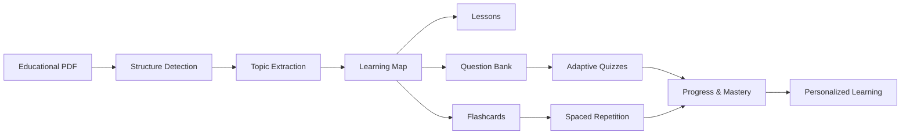
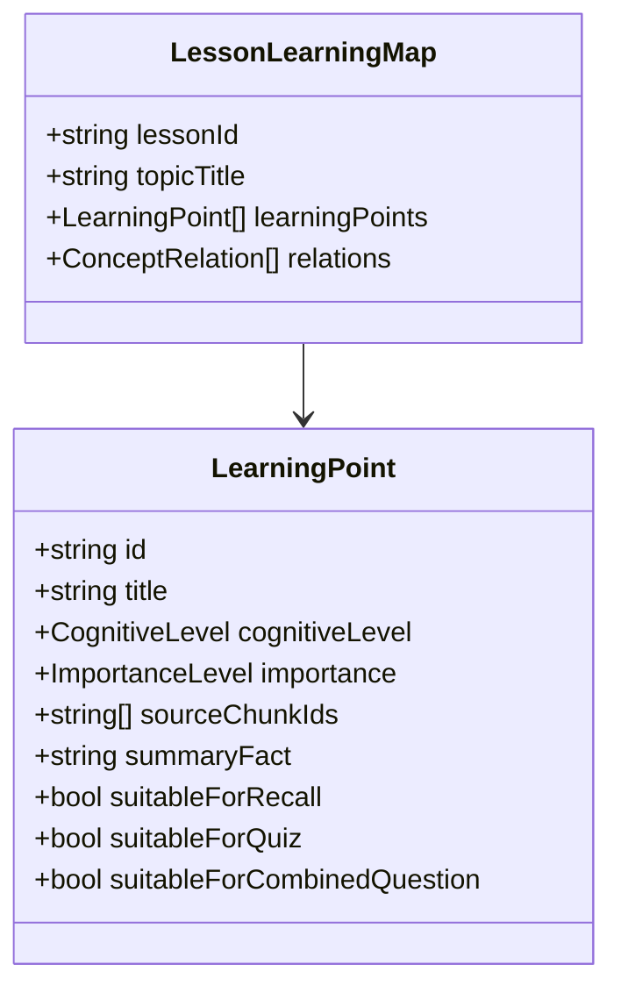
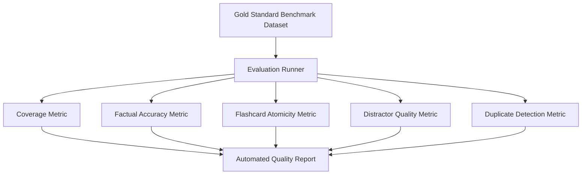

# سند رسمی سیاست آموزشی و هوش مصنوعی آوانا (AVANA AI Learning Policy)

---

**نسخه:** `v0.1`  
**وضعیت:** مصوب معماری محصول و هسته یادگیری (Approved Architecture & Policy Standard)  
**تاریخ انتشار:** آگوست ۲۰۲۶  
**حوزه شمول:** موتور پردازش اسناد، ModelGateway، ساختاردهی متون، نقشه یادگیری (Learning Map)، موتور تولید درس (Lesson Engine)، موتور فلش‌کارت (Flashcard Engine)، بانک سؤالات (Question Bank)، و آزمون‌گیر تطبیقی (Adaptive Quiz Engine).

---

## ۱. بیانیه مأموریت و فلسفه آموزشی آوانا (Core Product Mission)

### ۱.۱. اصل مرکزی محصول
> **آوانا (AVANA) صرفاً یک خلاصه‌ساز متون PDF یا یک چت‌بات ساده آموزشی نیست.**

رسالت بنیادین AVANA تبدیل اسناد علمی و آموزشی خام (جزوات، اسلایدهای دانشگاهی، کتب مرجع پزشکی و داروسازی) به یک **«تجربه یادگیری ساختاریافته، عمیق و امتحان‌محور»** است.



### ۱.۲. سلسله‌مراتب اولویت‌های آموزشی
در طراحی تمام الگوریتم‌ها و پرامپت‌های هوش مصنوعی، اولویت‌های سه‌گانه زیر بدون استثنا اعمال می‌شوند:

1. **آمادگی برای آزمون (Exam Preparation - اولویت اول):** پوشش کامل و بی‌نقص نکات امتحانی، تعاریف استاندارد، دسته‌بندی‌ها، استثناها، و الگوهای تکرارشونده در آزمون‌های دانشگاهی و جامع.
2. **مرور مؤثر و تثبیت در حافظه (Effective Review - اولویت دوم):** تبدیل مفاهیم حجیم به واحدهای اتمیک و قابل مرور در فواصل زمانی استاندارد (Active Recall & Spaced Repetition).
3. **فهم مفهومی و ارتباطات ساختاری (Deep Understanding - اولویت بنیادین):** تبیین علت‌ها، مکانیسم‌ها، ارتباط میان اجزا و کاربردهای بالینی/عملی.

### ۱.۳. اصل ارزش یادگیری در برابر حجم محتوا
> **«AVANA should optimize for learning value, not generated content volume.»**

تولید کارت‌های بیشتر یا سؤالات پرشمارتر نشانه کیفیت سیستم نیست. معیار موفقیت AVANA عبارت است از:
* **Better Coverage:** پوشش دقیق تمام نقاط کلیدی متن منبع بدون جاافتادگی.
* **Better Retrieval:** سرعت و سادگی بازیابی ذهنی مفاهیم توسط دانشجو در جلسه امتحان.
* **Better Understanding:** درک روابط علّی و کاربردی به جای انباشت واژگان.
* **Better Exam Readiness:** آمادگی واقعی و قابل سنجش برای حل سناریوهای تستی و تشریحی.

---

## ۲. ارزیابی انطباق با معماری فعلی سامانه (Current State vs Future Needs)

برای تضمین سازگاری کامل این سند با کدبیس و جلوگیری از هرگونه ادعای نادرست در مورد وضعیت کنونی، جدول زیر مرز میان قابلیت‌های پیاده‌سازی‌شده و نیازمندی‌های فازهای آتی را مشخص می‌کند:

| مؤلفه / لایه معماری | وضعیت در کدبیس فعلی (Current Implemented State) | نیازمندی و چشم‌انداز آینده (Future State Requirement) |
| :--- | :--- | :--- |
| **ورودی اسناد (Document Processing)** | استخراج متن از PDF/DOCX/PPTX به تفکیک صفحه، تولید Chunks مبتنی بر صفحات با هش SHA-256 و تخمین توکن در جدول `document_chunks`. | استخراج پیشرفته سرفصل‌ها از ساختار بصری و چیدمان صفحات، خوشه‌بندی چندصفحه‌ای بر پایه سرفصل (Section-aware Chunking). |
| **درگاه مدل (ModelGateway)** | واسط انتزاعی `ModelGateway` و پیاده‌سازی `MockModelGateway` تستی برای بازگرداندن پاسخ‌های ساختاریافته استاتیک. | اتصال به ارائه‌دهندگان واقعی LLM (مانند Gemini Pro/Flash, Claude, GPT)، سیستم کش معنایی، کنترل بودجه توکن و بازآزمایی خودکار. |
| **خط لوله تولید (Generation Pipeline)** | ماژول `GenerationService`، ثبت درخواست در صف BullMQ، جدول `generation_jobs` و تولید رکوردهای پیش‌نویس در `generated_contents`. | تفکیک پرامپت‌ها به لایه‌های چندگانه، موتور استخراج نقشه یادگیری (Learning Map Engine) به عنوان مرحله میانی الزامی. |
| **استناد به منبع (Source Grounding)** | جدول `generated_content_citations` برای متصل کردن هر خروجی تولیدشده به شناسه چانک‌های سند منبع (`document_chunk_id`). | استناد درون‌متنی دقیق (Inline Chunk Citations) در سطح پاراگراف‌های درس، فیلدهای گزینه‌های تست و پاسخ فلش‌کارت. |
| **بازبینی انسانی (Human-in-the-Loop)** | سرویس `ReviewService` و جریان کامل وضعیت‌های `draft` -> `accepted`/`rejected`/`edited`/`regenerating` و تجسد در جداول نهایی. | رابط پیش‌نمایش تفاوت‌های ویرایشی و امکان بازتولید بر پایه پرامپت تکمیلی دانشجو. |
| **هسته یادگیری (Learning Core)** | ساختار درختی `courses` -> `modules` -> `lessons` و ردیابی وضعیت اتمام در `lesson_progress`. | نگهداری ساختار درختی چندسطحی ناشی از استخراج خودکار سرفصل‌ها و شکستن سرفصل‌های بزرگ به ریزدرس‌ها. |
| **مرور فاصله‌دار (Flashcards & FSRS)** | جداول `flashcards` و `flashcard_reviews`، الگوریتم FSRS-inspired در `packages/domain/src/study.ts` با رتبه‌های ۴گانه. | دسته‌بندی موضوعی فلش‌کارت‌ها بر پایه Learning Points و تنظیم پویای توزیع کارت‌ها. |
| **آزمون‌ها (Quizzes & Question Bank)** | جداول `quizzes`، `quiz_questions` و `quiz_attempts` با آزمون‌های ایستا و تصحیح خودکار تستی. | ایجاد مفهوم رسمی «بانک سؤالات درس (Question Bank)»، ردیابی مهارت دانشجو در هر Learning Point، و موتور انتخاب هوشمند/تطبیقی. |

---

## ۳. سیاست ورودی اسناد (PDF Input Policy)

در نسخه اولیه (MVP) سامانه:
1. **پردازش سراسری فایل (Whole PDF Processing):** کل سند بارگذاری‌شده به عنوان یک واحد ورودی پردازش می‌شود.
2. **عدم انتخاب بازه صفحات توسط سیستم:** AVANA در MVP مسئول فیلتر کردن صفحات غیرضروری (مانند مقدمه، منابع، فهرست طولانی یا صفحات سفید) نیست. کاربر موظف است در صورت تمایل به مطالعه بخشی خاص، فایل را پیش از بارگذاری آماده و صفحات زائد را حذف کند.
3. **تحلیل خودکار ساختار درونی:** سامانه باید ساختار منطقی درونی متن بارگذاری‌شده را بدون اتکا به ساختار فیزیکی صفحات استخراج کند.

---

## ۴. کشف ساختار و تبدیل سرفصل‌ها (Structure Detection & Topic Extraction)

```
┌─────────────────────────────────────────────────────────────┐
│                       Educational PDF                       │
│  Chapter 5: Autonomic Pharmacology                          │
│    5.1 Introduction to Autonomic Nervous System             │
│    5.2 Cholinergic Drugs (Agonists & Antagonists)           │
│    5.3 Adrenergic Agonists (Sympathomimetics)               │
│    5.4 Adrenergic Antagonists (Sympatholytics)              │
└──────────────────────────────┬──────────────────────────────┘
                               │
                               ▼
┌─────────────────────────────────────────────────────────────┐
│                 Structure Detection Engine                  │
│  - Heading Hierarchy Detection                              │
│  - Topic Size & Cognitive Load Evaluation                   │
└──────────────────────────────┬──────────────────────────────┘
                               │
                               ▼
┌─────────────────────────────────────────────────────────────┐
│                   Target Lessons (Modules)                  │
│  Lesson 1: Autonomic System Fundamentals                    │
│  Lesson 2: Cholinergic Receptor Agonists                    │
│  Lesson 3: Anticholinergic / Muscarinic Antagonists         │
│  Lesson 4: Adrenergic Receptor Agonists (Alpha & Beta)      │
│  Lesson 5: Adrenergic Receptor Antagonists (Beta Blockers)  │
└─────────────────────────────────────────────────────────────┘
```

### ۴.۱. قواعد کشف ساختار
1. **استخراج سلسله‌مراتبی:** موتور هوش مصنوعی باید تیترها، زیرتیترها، شماره‌گذاری‌ها و تقسیم‌بندی‌های محتوایی را شناسایی کند.
2. **قاعده تناظر موضوع به درس (Topic-to-Lesson Rule):** هر سرفصل یا مفهوم کلیدی مستقل، یک واحد درسی (`Lesson`) در سامانه تشکیل می‌دهد.
3. **شکستن سرفصل‌های بزرگ (Large Topic Splitting):** چنانچه یک سرفصل بیش از حد حجیم بوده یا دارای بار شناختی چندگانه باشد، سامانه مجاز و موظف است آن را به چند درس منطقی بشکند.
4. **ممنوعیت خرد کردن بی‌دلیل (Anti-Fragmentation Rule):** تقسیم سرفصل‌ها نباید به از دست رفتن انسجام علمی مطلب یا ایجاد درس‌های بسیار کوتاه و تک‌پاراگرافی منجر شود.

---

## ۵. معماری نقشه یادگیری (The Learning Map Architecture)

نقشه یادگیری (**Learning Map**) قلب تپنده و هسته مرکزی پردازش هوشمند در AVANA است. هیچ درس، فلش‌کارت یا سؤالی نباید مستقیماً از متن خام تولید شود؛ تمام محتواها باید از Learning Map مشتق شوند.



### ۵.۱. ساختار نقطه یادگیری (Learning Point - LP)
برای هر درس، مجموعه‌ای ساخت‌یافته از نقاط یادگیری استخراج می‌شود:

```json
{
  "lesson_title": "بتابلوکرها (Beta-Adrenergic Blockers)",
  "learning_points": [
    {
      "id": "LP01",
      "title": "تعریف و دسته‌بندی پایه",
      "cognitive_level": "recall",
      "importance": "high",
      "source_chunk_ids": ["chk_101", "chk_102"],
      "summary_fact": "داروهای مسدودکننده رقابتی گیرنده‌های بتای آدرنرژیک"
    },
    {
      "id": "LP02",
      "title": "تفکیک گیرنده‌های بتا ۱ و بتا ۲",
      "cognitive_level": "understanding",
      "importance": "critical",
      "source_chunk_ids": ["chk_102"],
      "summary_fact": "بتا ۱ عمدتاً در قلب و بتا ۲ در عضلات صاف برونش و عروق مستقر است"
    },
    {
      "id": "LP03",
      "title": "مکانیسم اثر سلولی و مولکولی",
      "cognitive_level": "understanding",
      "importance": "high",
      "source_chunk_ids": ["chk_103"],
      "summary_fact": "کاهش cAMP داخل سلولی و مهار اثرات کاتکول‌آمین‌ها"
    },
    {
      "id": "LP04",
      "title": "داروهای انتخابی در برابر غیرانتخابی",
      "cognitive_level": "comparison",
      "importance": "critical",
      "source_chunk_ids": ["chk_104"],
      "summary_fact": "متوپرولول و آتنولول انتخابی بتا ۱؛ پروپرانولول غیرانتخابی (بتا ۱ و ۲)"
    },
    {
      "id": "LP05",
      "title": "اندیکاسیون‌های بالینی اصلی",
      "cognitive_level": "application",
      "importance": "critical",
      "source_chunk_ids": ["chk_105"],
      "summary_fact": "پرفشاری خون، آنژین صدری، آریتمی قلبی، نارسایی قلبی و پیشگیری از میگرن"
    },
    {
      "id": "LP06",
      "title": "موارد منع مصرف قطعی و نسبی",
      "cognitive_level": "application",
      "importance": "critical",
      "source_chunk_ids": ["chk_106"],
      "summary_fact": "آسم شدید، برونکواسپاسم، بلوک‌های هدایتی درجه ۲ و ۳، برادی‌کاردی شدید"
    },
    {
      "id": "LP07",
      "title": "عوارض جانبی مهم",
      "cognitive_level": "recall",
      "importance": "high",
      "source_chunk_ids": ["chk_107"],
      "summary_fact": "برادی‌کاردی، خستگی، سردی اندام‌ها، اختلال خواب، پوشاندن علائم هیپوگلیسمی"
    },
    {
      "id": "LP08",
      "title": "تداخلات دارویی و بالینی",
      "cognitive_level": "synthesis",
      "importance": "medium",
      "source_chunk_ids": ["chk_108"],
      "summary_fact": "تداخل هم‌افزا با مسدودکننده‌های کانال کلسیمی نوع غیردی‌هیدروپیریدینی (وراپامیل)"
    }
  ],
  "composite_relationships": [
    {
      "source_lps": ["LP04", "LP06"],
      "relationship_type": "clinical_contraindication_rationale",
      "description": "چرا پروپرانولول در بیماران آسمی ممنوع است اما متوپرولول با احتیاط قابل استفاده است؟"
    },
    {
      "source_lps": ["LP02", "LP07"],
      "relationship_type": "mechanism_to_adverse_effect",
      "description": "ارتباط مهار بتا ۲ با تشدید بیماری‌های عروق محیطی و برونکواسپاسم"
    }
  ]
}
```

### ۵.۲. وظایف نقشه یادگیری
1. **شفاف‌سازی اهداف یادگیری:** تعیین دقیق آنچه باید به خاطر سپرده شود، فهمیده شود یا به کار بسته شود.
2. **تعیین وزن و اهمیت:** اولویت‌بندی مفاهیم برای تمرکز بیشتر در آزمون‌ها و مرورها.
3. **زیربنای بانک سؤالات:** تولید سؤالات تستی بر پایه تقاطع یک یا چند نقطه یادگیری.
4. **تغذیه ردیاب مهارت دانشجو:** سنجش میزان تسلط دانشجو بر حسب درصدی از Learning Points موجود در درس.

---

## ۶. سیاست تدوین و تولید درس (Lesson Generation Policy)

### ۶.۱. اصل ورود مستقیم و بدون حاشیه (Direct Teaching Principle)
> **«آموزش را از اولین مفهوم واقعی سرفصل آغاز کن.»**

درس‌ها در AVANA برای دانشجویانی طراحی شده‌اند که با کمبود وقت و فشار امتحانات مواجهند. از این رو، تولید هرگونه مقدمه کلیشه‌ای، تعارفات متنی، یا جملات فاقد ارزش دانشی شدیداً ممنوع است:

* ❌ **جملات ممنوع:**
  * *"در این درس قصد داریم به بررسی مفهوم مهم بتابلوکرها بپردازیم..."*
  * *"همان‌طور که می‌دانید داروها نقش مهمی در سلامت دارند و در ادامه..."*
  * *"در بخش قبلی با مقدمات آشنا شدیم و اکنون وقت آن است که..."*
* ✅ **شروع استاندارد:**
  * *"بتابلوکرها دسته‌ای از داروهای قلبی-عروقی هستند که با مسدود کردن رقابتی گیرنده‌های بتای آدرنرژیک، اثرات تحریک‌کننده سمپاتیک بر قلب و عروق را مهار می‌کنند."*

### ۶.۲. ساختار منعطف درس
ساختار یک درس باید متناسب با محتوا شکل بگیرد و از قالب‌های صلب و مصنوعی پرهیز شود. ساختار پیشنهادی:

```markdown
# [عنوان دقیق درس]

## مفهوم اصلی و تعریف پایه
[توضیح مستقیم و واضح مفهوم بدون حاشیه]

## سازوکار و تحلیل ساختاری
[شرح مکانیسم‌ها، طبقه‌بندی و روابط مفهومی میان اجزا]

## کاربردها و نکات بالینی / عملی (در صورت وجود در منبع)
[اندیکاسیون‌ها، موارد منع مصرف یا قواعد کاربردی]

## جدول مقایسه‌ای / خلاصه طبقه‌بندی (در صورت لزوم)
[نمایش ماتریسی تفاوت‌ها برای مرور سریع]

## جمع‌بندی نکات کلیدی آزمون
* نکته ۱
* نکته ۲
```

---

## ۷. سبک آموزش و اصول پداگوژی (Pedagogical Framework)

1. **حرکت از ساده به پیچیده (Concrete to Abstract):** تثبیت مبانی پیش از تشریح استثناها و جزئیات پیچیده.
2. **مثال و قیاس هدفمند (Judicious Analogies):** استفاده از تمثیل فقط برای مباحث انتزاعی یا با فهم دشوار مجاز است؛ از تمثیل‌سازی برای بدیهیات خودداری شود.
3. **ابزارهای حافظه و یادیارها (Targeted Mnemonics):** یادیارها تنها برای دسته‌بندی‌های فرار یا لیست‌های طولانی دارویی که جنبه حفظی صرف دارند پیشنهاد می‌شوند.

---

## ۸. تفکیک محتوای منبع و اطلاعات تکمیلی هوش مصنوعی (Source vs AI Supplementary Content)

یکی از ریسک‌های بزرگ سیستم‌های کمک‌آموزشی، ارائه اطلاعات توهم‌آمیز یا اضافه‌کردن فکت‌هایی است که در رفرنس امتحانی دانشجو نیامده است.

### ۸.۱. تفکیک شفاف محتوا
تمام محتواهای آموزشی در AVANA به دو دسته مجزا تقسیم می‌شوند:
1. **محتوای مستند به منبع (Source-Grounded Content):** دقیقاً منطبق بر گزاره‌های موجود در سند بارگذاری‌شده.
2. **اطلاعات تکمیلی هوش مصنوعی (AI Supplementary Content):** توضیحات اضافی جهت تسهیل درک مطلب که در متن PDF صراحتاً ذکر نشده است.

### ۸.۲. استاندارد برچسب‌گذاری الزامی
هرگونه اطلاعات تکمیلی که از دانش پایه‌ای مدل اضافه می‌شود، **باید** با برچسب استاندارد و برجسته زیر متمایز گردد:

> 💡 **اطلاعات تکمیلی آوانا — در منبع اصلی ذکر نشده است:**  
> گیرنده‌های بتا ۱ عمدتاً در بافت گره‌های دهلیزی-بطنی و میوکارد قرار دارند، در حالی که گیرنده‌های بتا ۲ در ماهیچه‌های صاف مجاری تنفسی و عروق محیطی غالب هستند.

### ۸.۳. سیاست مواجهه با اطلاعات ناقص در منبع (Missing Information Policy)
اگر یک مفهوم در سند ناقص رها شده باشد، هوش مصنوعی نباید با حدس و گمان نقص را پنهان کند؛ بلکه باید صراحتاً اعلام نماید:
> ⚠️ **توجه:** این جزئیات در متن منبع ارائه نشده است و برای امتحانات متکی بر جزوه، نیاز به مطالعه خارج از منبع ندارد.

---

## ۹. فلسفه و قواعد فلش‌کارت‌ها (Flashcard Policy & Standards)

```
┌─────────────────────────────────────────────────────────────┐
│                    FLASHCARD GOLDEN RULE                    │
│                                                             │
│              ONE CARD = ONE LEARNING POINT                  │
│                                                             │
│  - No omnibus cards                                         │
│  - Instant cognitive recall (< 5 seconds)                   │
│  - Clear, unambiguous prompt                                │
└─────────────────────────────────────────────────────────────┘
```

### ۹.۱. اصل عدم محدودیت تعداد در برابر اتمیک بودن
* **تعداد کل کارت‌ها:** هیچ سقف یا کف عددی تحمیلی برای فلش‌کارت‌های یک درس وجود ندارد.
* **اندازه کارت:** هر کارت باید منحصراً **یک نکته آموزشی مجزا** را بسنجد.

### ۹.۲. نمونه‌های منفی و مثبت

| وضعیت | متن پرسش و پاسخ کارت | علت ارزیابی |
| :--- | :--- | :--- |
| ❌ **بسیار بد (Omnibus Card)** | **پرسش:** مکانیسم، کاربردها، عوارض و تداخلات داروی پروپرانولول را توضیح دهید.<br>**پاسخ:** مسدودکننده غیرانتخابی بتا... درمان فشارخون و آنژین... عوارض شامل برادی‌کاردی و آسم... تداخل با وراپامیل... | کارت بسیار طولانی، غیرقابل سنجش در سیستم مرور فاصله‌دار، ناتوانی دانشجو در ارزیابی نمره خود. |
| ✅ **استاندارد ۱ (مکانیسم)** | **پرسش:** مکانیسم عمل داروی پروپرانولول چیست؟<br>**پاسخ:** مسدودکننده رقابتی و غیرانتخابی گیرنده‌های بتای ۱ و ۲ آدرنرژیک. | تک‌مفهومی، بازیابی سریع ذهنی، سنجش دقیق. |
| ✅ **استاندارد ۲ (منع مصرف)** | **پرسش:** چرا مصرف پروپرانولول در بیماران مبتلا به آسم منع مصرف مطلق دارد؟<br>**پاسخ:** به دلیل مهار گیرنده‌های بتا ۲ و ایجاد انقباض برونش (برونکواسپاسم). | سنجش رابطه علت و معلولی در یک گام. |
| ✅ **استاندارد ۳ (عوارض کلیدی)**| **پرسش:** مهم‌ترین خطر مصرف بتابلوکرها در بیماران دیابتی چیست؟<br>**پاسخ:** پوشاندن علائم هشداردهنده هیپوگلیسمی (مانند تاکی‌کاردی و لرزش). | نکته مهم امتحانی، متمرکز و صریح. |

### ۹.۳. گونه‌شناسی کارت‌ها (Flashcard Taxonomy)
توزیع انواع کارت‌ها نباید متصلب باشد، بلکه باید متناسب با موضوع درس تعیین گردد:
* **Recall / Key Fact:** یادآوری اسامی، اعداد شاخص، دسته‌بندی‌ها.
* **Definition:** تعاریف اصطلاحات تخصصی.
* **Mechanism:** سازوکار دارویی، فیزیولوژیک یا شیمیایی.
* **Comparison:** مقایسه تفاوت دو داروی هم‌خانواده یا دو ساختار شیمیایی.
* **Application / Clinical Scenario:** مواجهه بالینی تک‌خطی و تصمیم تشخیصی/درمانی.
* **Cloze Deletion (جای خالی):** جملات کلیدی با حذف یک واژه یا اصطلاح تعیین‌کننده.

---

## ۱۰. فلسفه آزمون‌ها و بانک سؤالات (Question Bank & Adaptive Quizzes)

```
┌─────────────────────────────────────────────────────────────┐
│                      Lesson Learning Map                    │
│         [LP01] [LP02] [LP03] [LP04] [LP05] [LP06] ...       │
└──────────────────────────────┬──────────────────────────────┘
                               │
                               ▼
┌─────────────────────────────────────────────────────────────┐
│                     Lesson Question Bank                    │
│                                                             │
│   Easy (Recall):              Medium (Understanding/App):   │
│   - Q1: Single LP01 Fact      - Q4: Scenario using LP05     │
│   - Q2: Definition LP02       - Q5: Comparison LP02 vs LP04 │
│   - Q3: Classification LP04   - Q6: Clinical contraind LP06 │
│                                                             │
│   Hard (Synthesis / Combined):                              │
│   - Q7: [LP03 + LP07] Mechanism linked to Adverse Effect    │
│   - Q8: [LP04 + LP06] Selective Drug Choice in Asthma       │
│   - Q9: [LP05 + LP08] Comorbid Patient Management           │
└──────────────────────────────┬──────────────────────────────┘
                               │
            ┌──────────────────┴──────────────────┐
            │  Adaptive Quiz Selection Algorithm  │
            │  - Weakness weights                 │
            │  - Learning Point Coverage          │
            │  - Recency penalty                  │
            │  - Target Difficulty Mix            │
            └──────────────────┬──────────────────┘
                               │
                               ▼
┌─────────────────────────────────────────────────────────────┐
│                   Active Student Quiz (5-10 Qs)             │
│        Targeted, Personalized, Exam-Focused Evaluation      │
└─────────────────────────────────────────────────────────────┘
```

### ۱۰.۱. اصل بانک سؤالات به جای آزمون ایستا
در AVANA آزمون با تعداد سؤالات ثابت (مثلاً ۱۰ سؤال همیشگی برای یک درس) وجود ندارد. برای هر درس، یک **بانک سؤالات (Question Bank)** تولید می‌شود که مخزن اصلی ارزیابی‌های مکرر خواهد بود.

### ۱۰.۲. سطوح دشواری مبتنی بر وظیفه شناختی (Cognitive Difficulty Tiers)
سطح دشواری سؤال با پیچیده‌کردن ادبیات جمله تعیین نمی‌شود؛ بلکه مبتنی بر سطح پردازش مغزی است:

1. **سطح آسان (Easy - Direct Recall):** بازیابی مستقیم یک فکت، نام دارو، عدد مشخص، یا تعریف از متن منبع.
2. **سطح متوسط (Medium - Understanding & Single-Concept Application):** درک مفهوم، چرایی یک واکنش، یا کاربرد مستقیم یک قاعده در یک موقعیت ساده.
3. **سطح دشوار (Hard - Synthesis & Clinical Reasoning):** ترکیب حداقل دو نقطه یادگیری (`Combined Questions`) یا حل سناریوی چندمرحله‌ای بالینی.

### ۱۰.۳. سؤالات ترکیبی (Combined Questions)
بانک سؤالات باید پیوند میان مباحث مختلف را ارزیابی کند:
* **مکانیسم + عارضه:** ارتباط مهار یک آنزیم با بروز عارضه در اندام هدف.
* **مکانیسم + اندیکاسیون:** علت برتری یک دارو بر داروی دیگر در بیماری زمینه‌ای خاص.
* **دارو + بیمار با بیماری همراه + منع مصرف:** انتخاب داروی ایمن در بیماری که همزمان دچار پرفشاری خون و آسم است.

---

## ۱۱. موتور انتخاب آزمون تطبیقی (Adaptive Quiz Selection Engine)

هنگامی که دانشجو درخواست یک کوئیز جدید می‌دهد، سیستم سؤالات را بر پایه الگوریتم **«انتخاب تصادفی مشروط (Constrained Intelligent Selection)»** گزینش می‌کند:

$$\text{SelectionWeight}(Q) = w_{\text{weakness}} \times w_{\text{coverage}} \times w_{\text{difficulty}} \times w_{\text{recency}} \times \text{RandomNoise}$$

### ۱۱.۱. عوامل تأثیرگذار در انتخاب سؤال
1. **نقاط ضعف دانشجو (Student Weakness Weight):** سؤالاتی که نقاط یادگیری (LPs) مربوط به آن‌ها در آزمون‌های قبلی دانشجو با پاسخ غلط مواجه شده‌اند، وزن بالاتری می‌گیرند.
2. **پوشش یکپارچه نقشه یادگیری (Coverage Guarantee):** آزمون باید اطمینان حاصل کند که تمام LPs اصلی درس در چند آزمون متوالی پوشش داده می‌شوند.
3. **توازن دشواری (Difficulty Target):** توزیع پیش‌فرض معمولاً شامل ۳۰٪ آسان، ۵۰٪ متوسط و ۲۰٪ دشوار است (قابل تنظیم برای آمادگی نهایی به ۲۰٪ آسان، ۴۰٪ متوسط، ۴۰٪ دشوار).
4. **جلوگیری از تکرار زودرس (Recency Penalty):** سؤالاتی که دانشجو در ۲۴ یا ۴۸ ساعت گذشته مشاهده کرده، وزن کمتری دریافت می‌کنند مگر اینکه به آن‌ها پاسخ غلط داده باشد.
5. **تثبیت نقاط قوت:** نقاط قوت دانشجو به طور کامل حذف نمی‌شوند، بلکه با فرکانس کمتر جهت نگهداری آمادگی در آزمون ظاهر می‌شوند.

---

## ۱۲. استنادپذیری و منشأ داده‌ها (Source Grounding & Provenance)

هر داده‌ای که توسط سیستم تولید و به کاربر نمایش داده می‌شود باید دارای شناسنامه منشأ (Provenance) باشد:

```ts
interface ContentProvenance {
  documentId: string;
  sourceChunkIds: string[];
  pageNumbers: number[];
  learningPointId: string;
  contentType: "source_grounded" | "ai_supplementary";
  confidenceScore?: number;
}
```

* **عدم نمایش محتوای معلق:** هیچ پاراگراف آموزشی، فلش‌کارت یا سؤالی نباید بدون انتساب به حداقل یک `document_chunk_id` تایید یا ذخیره شود.
* **امکان مشاهده صفحه سند:** کاربر باید بتواند با کلیک روی هر نکته، صفحه یا بخش مربوطه در سند اصلی را مشاهده کند.

---

## ۱۳. الزامات محتوای پزشکی، داروسازی و سلامت (Medical Domain Guardrails)

با توجه به ماهیت حساس و تخصصی منابع پزشکی و داروسازی در AVANA، رعایت ضوابط زیر حیاتی و الزامی است:

1. **تحمل صفر در برابر توهم (Zero Tolerance for Hallucination):** ارقام دوزاژ، اسامی ژنریک و تجاری، واحدهای اندازه‌گیری، مسیرهای متابولیکی و ساختارهای بیوشیمیایی باید ۱۰۰٪ با متن منبع منطبق باشند.
2. **پاسخ قطعی و دفاع‌پذیر (Single Defensible Answer):** هر سؤال تستی باید دقیقاً یک گزینه صحیح علمی و غیرقابل مناقشه بر اساس متن منبع داشته باشد.
3. **گزینه‌های انحرافی باورپذیر اما غلط (Plausible & Safe Distractors):** گزینه‌های غلط باید از نظر منطق علمی باورپذیر باشند، اما حاوی ادعاهای پزشکی خطرناک، ساختگی یا گمراه‌کننده نباشند.
4. **پرهیز از ابهام بالینی در صورت سکوت رفرنس:** اگر متن منبع در مورد یک موقعیت بالینی ساکت است، نباید پیرامون آن سؤال تستی سلیقه‌ای یا مبهم طرح شود.

---

## ۱۴. معماری لایه‌ای پرامپت‌ها (Layered Prompt Architecture)

پرامپت‌های ارسال‌شده به LLM نباید به صورت یک بلوک متنی غول‌پیکر و غیرقابل نگهداری باشند، بلکه از ترکیب لایه‌های ماژولار زیر تشکیل می‌شوند:

```
┌─────────────────────────────────────────────────────────────┐
│ 1. GLOBAL AVANA POLICY                                      │
│    - Role, direct teaching style, zero fluff, markdown rules│
├─────────────────────────────────────────────────────────────┤
│ 2. SUBJECT-SPECIFIC POLICY                                  │
│    - Pharmacology / MedChem / Pharmacognosy guidelines      │
├─────────────────────────────────────────────────────────────┤
│ 3. CONTENT-TYPE POLICY                                      │
│    - Specific rules for Lesson / Flashcard / Question Bank  │
├─────────────────────────────────────────────────────────────┤
│ 4. LEARNING MAP CONTEXT                                     │
│    - Targeted Learning Points, cognitive levels, relations  │
├─────────────────────────────────────────────────────────────┤
│ 5. STUDENT CONTEXT (For Adaptive Generation)                │
│    - Known weaknesses, past errors, mastery targets         │
├─────────────────────────────────────────────────────────────┤
│ 6. SOURCE CHUNKS                                            │
│    - Verbatim cited text blocks with IDs and page numbers   │
├─────────────────────────────────────────────────────────────┤
│ 7. TASK INSTRUCTIONS & JSON SCHEMA                          │
│    - Strict output schema and validation contract           │
└─────────────────────────────────────────────────────────────┘
```

---

## ۱۵. چارچوب سیاست‌های موضوعی تخصصی (Subject-Specific Policy Framework)

این چارچوب به عنوان یک الگوی راهنما جهت هدایت پرامپت‌های تخصصی در شاخه‌های گوناگون علوم دارویی و پزشکی تعریف شده است:

```
                      SUBJECT-SPECIFIC POLICIES
                                 │
     ┌───────────────────────────┼───────────────────────────┐
     ▼                           ▼                           ▼
Pharmacology            Medicinal Chemistry            Pharmacognosy
- Mechanism of Action   - Chemical Structure & SAR    - Biological Source
- Receptor Subtypes     - Functional Groups           - Active Constituents
- Indications           - Physicochemical Properties  - Extraction & Tests
- Contraindications     - Metabolism & Bioisosterism  - Adulteration
- Adverse Reactions     - Synthesis Pathways          - Therapeutic Uses
- Drug Interactions
```

### ۱۵.۱. فارماکولوژی (Pharmacology)
* تمرکز بر دسته‌بندی دارویی، فارماکودینامیک (گیرنده‌ها، آگونیست/آنتاگونیست)، فارماکوکینتیک (جذب، دفع، سیتوکروم‌ها)، کاربرد بالینی، عوارض جانبی تیپیک و موارد منع مصرف.

### ۱۵.۲. شیمی دارویی (Medicinal Chemistry)
* تمرکز بر ارتباط ساختار و فعالیت (SAR)، گروه‌های عاملی تعیین‌کننده، حلالیت و نفوذپذیری غشایی (Lipophilicity / LogP)، ایزواستریسم و تغییرات متابولیکی دارو در بدن.

### ۱۵.۳. فارماکوگنوزی و گیاهان دارویی (Pharmacognosy)
* تمرکز بر نام علمی گیاه/منبع زیستی (Genus & Species)، خانواده گیاهی، بخش مورد استفاده، متابولیت‌های ثانویه اصلی (آلکالوئیدها، ترپنوئیدها، فلانوئیدها)، تست‌های شناسایی و موارد تقلب دارویی.

---

## ۱۶. دروازه‌های کیفیت خروجی هوش مصنوعی (AI Quality Gates)

هر خروجی پیش از ثبت در پایگاه داده یا نمایش به عنوان پیش‌نویس، از فیلترهای کنترلی زیر عبور می‌کند:

### ۱۶.۱. دروازه کیفیت درس (Lesson Quality Gate)
* [ ] آیا درس بدون مقدمه‌های کلیشه‌ای و از مفهوم اصلی آغاز شده است؟
* [ ] آیا تمام ادعاهای فکتوال مستند به چانک‌های منبع هستند؟
* [ ] آیا اطلاعات تکمیلی به وضوح برچسب‌گذاری شده‌اند؟
* [ ] آیا از به کار بردن واژگان نامفهوم یا گنگ خودداری شده است؟

### ۱۶.۲. دروازه کیفیت فلش‌کارت (Flashcard Quality Gate)
* [ ] آیا اصل «یک کارت = یک مفهوم» رعایت شده است؟
* [ ] آیا زمان خواندن و پاسخ به کارت کمتر از چند ثانیه است؟
* [ ] آیا کارت حاوی سؤالات مبهم، دوپهلو یا چندقسمتی نیست؟
* [ ] آیا پاسخ کاملاً متقن و مستند به منبع است؟
* [ ] آیا کارت نسبت به سایر کارت‌های همان درس تکراری نیست؟

### ۱۶.۳. دروازه کیفیت سؤال آزمون (Question Quality Gate)
* [ ] آیا سؤال دارای دقیقاً یک پاسخ صحیح قطعی و دفاع‌پذیر است؟
* [ ] آیا گزینه‌های غلط (Distractors) همگن و باورپذیر بوده و فاقد اطلاعات مخرب هستند؟
* [ ] آیا سطح دشواری به درستی بر پایه وظیفه شناختی تنظیم شده است؟
* [ ] آیا سؤال مفهوم را می‌سنجد نه صرفاً یک بازی با کلمات ظاهری؟

---

## ۱۷. روش‌شناسی ارزیابی و بنچ‌مارک (Evaluation Methodology)

برای اطمینان از عملکرد مدل در سناریوهای واقعی دانشگاهی، یک خط لوله ارزیابی مستمر (Continuous Evaluation Pipeline) به شرح زیر اجرا می‌گردد:



### ۱۷.۱. ایجاد مجموعه داده مرجع (Gold Standard Benchmark)
* انتخاب ۱۰ سند دانشگاهی استاندارد و پرتکرار در حوزه‌های فارماکولوژی، شیمی دارویی، فارماسیوتیکس، فیزیولوژی و پاتولوژی.
* استخراج دستی نقشه یادگیری، فلش‌کارت‌ها و سؤالات تستی مرجع توسط اساتید یا دانشجویان رتبه برتر.
* مقایسه کمی و کیفی خروجی هوش مصنوعی با این مجموعه مرجع به ازای هر بار ارتقای نسخه پرامپت یا تغییر مدل LLM.

### ۱۷.۲. شاخص‌های سنجش کیفی (Key Metrics)
* **نرخ پوشش نقشه یادگیری (LP Coverage Rate):** درصد پوشش مفاهیم مرجع (هدف: > ۹۵٪).
* **دقت استناد (Citation Precision):** نسبت انتساب‌های صحیح به چانک‌ها (هدف: ۱۰۰٪).
* **نرخ کارت‌های ترکیبی ممنوعه (Omnibus Card Rate):** درصد کارت‌های غیراتمیک (هدف: ۰٪).
* **نرخ سؤالات مبهم یا غلط (Defect Rate):** درصد سؤالات با گزینه‌های نامعتبر (هدف: < ۲٪).
* **نرخ شباهت و افزونگی (Duplication Rate):** سنجش هم‌پوشانی متون تولیدشده (هدف: < ۵٪).

---

## ۱۸. نسخه‌گذاری و حاکمیت سند (Policy Governance & Versioning)

* **شماره‌گذاری نسخ:** تغییرات در این سند با الگوی Semantic Versioning ثبت می‌گردد (مانند `v0.1` برای تدوین اولیه، `v1.0` همزمان با اتصال اولین پرووایدر LLM واقعی).
* **انطباق پرامپت‌ها با نسخه سیاست:** هر پرامپتی که در سیستم ثبت می‌شود (`prompt_version`) باید به نسخه مشخصی از این سند ارجاع داشته باشد.
* **مرجعیت سند:** در کلیه تضادهای فنی یا طراحی میان تیم‌های مهندسی، محصول و طراحی آموزشی، مفاد این سند مرجع نهایی و حاکم خواهد بود.
