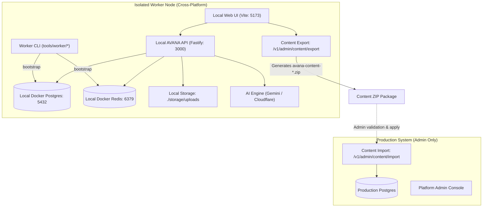

# AVANA Worker Environment Setup & Operational Guide

This guide details the architecture, configuration, security boundaries, and daily workflows for **AVANA Content Workers**.

AVANA Workers are independent, local instances designed for instructors and content curators to author, generate with AI, review, and approve curriculum content offline or in isolated environments, and subsequently export their finalized content via encrypted ZIP packages to the primary AVANA platform.

---

> [!CAUTION]
> ### What a Worker MUST NEVER Receive
>
> To safeguard user data, intellectual property, and payment systems, **Workers are strictly quarantined from Production**:
>
> 1. **NEVER provide Production Database URLs or Credentials**:
>    - Workers must **NEVER** receive `DATABASE_URL` pointing to AWS RDS, Supabase, Neon, Railway, or any remote IP/hostname.
>    - The Worker runtime includes a **fail-closed security blocker** that immediately terminates setup or execution if a non-local database host is detected.
> 2. **NEVER grant `platform_admin` Role to Worker Accounts**:
>    - Worker accounts are strictly assigned `global_role: "content_worker"`.
>    - Workers are permitted to author, generate, review, approve, and **export** content.
>    - Workers are **forbidden** from managing users, viewing commerce transactions, altering platform configurations, or executing **Production Import**.
> 3. **NEVER provide Production Payment Gateway Secrets**:
>    - `ZARINPAL_MERCHANT_ID`, Card-to-Card numbers, or banking credentials must **NEVER** be copied to a Worker environment.
>    - The Worker environment automatically forces `PAYMENT_PROVIDER=mock`.
> 4. **NEVER provide Production Email / Transactional Credentials**:
>    - `RESEND_API_KEY` or SMTP production credentials must **NEVER** be shared.
>    - The Worker environment automatically forces `EMAIL_PROVIDER=mock`.
> 5. **NEVER provide Production User Data or PII**:
>    - Content workers only require the curriculum baseline catalog (courses, modules, lessons). No student records, orders, or user databases should ever be imported into a Worker node.

---

## Architecture Overview



---

## System Requirements

The Worker CLI and runtime are pure Node.js + TypeScript, designed to run natively on **Windows (PowerShell / Command Prompt)**, **Linux**, and **macOS**:

- **Node.js**: `v22.0.0` or higher
- **npm**: `v10.0.0` or higher
- **Docker Engine & Docker Compose**:
  - **Windows & macOS**: [Docker Desktop](https://www.docker.com/products/docker-desktop/) (must be running)
  - **Linux**: Docker Engine (`sudo apt install docker-ce docker-compose-plugin`)

---

## 1. Initial AI Configuration (`.env.worker-ai`)

Workers connect directly to approved AI model providers (such as Google Gemini) to generate lesson summaries, flashcards, and quizzes.

1. Copy the template:
   ```bash
   cp .env.worker-ai.example .env.worker-ai
   ```
2. Populate `.env.worker-ai` with your assigned API keys:
   ```bash
   AI_PRIMARY_PROVIDER=gemini
   AI_ENABLE_FALLBACK=false
   GEMINI_API_KEY=AIzaSyYourKeyHere
   GEMINI_MODEL=gemini-2.5-flash
   ```

> [!IMPORTANT]
> **Strict AI Fallback Invariant:**
> `AI_ENABLE_FALLBACK` is strictly enforced to `false` in Worker environments. Under no circumstances will a failure in Gemini fall back to Groq or unauthorized secondary providers.

---

## 2. Worker Setup & Bootstrap (`npm run worker:setup`)

Run the automated bootstrap command:

```bash
npm run worker:setup
```

### What `worker:setup` does automatically:
1. **Validates System Prerequisites**: Checks Node `>= 22`, npm, and Docker daemon status.
2. **Identity & Secure Credential Management**:
   - Assigns Worker ID (default: `worker-001`, or via `--id=worker-002`).
   - If interactive, prompts for a password; or generates a cryptographically secure 16-character password and displays it once in a highlighted terminal alert.
   - Hashes credentials using constant-time Scrypt (`hashPassword`).
3. **Isolates Environment**:
   - Reads `.env.worker-ai`.
   - Strips any production secrets.
   - Configures local Postgres (`127.0.0.1:5432`), local Redis (`127.0.0.1:6379`), and local storage (`./storage/uploads`).
   - Enforces fail-closed local database host validation.
   - Writes secured `.env` (permissions `0600`).
4. **Boots Infrastructure**:
   - Runs `docker compose -f infra/local/compose.yaml -p avana-worker-<workerId> up -d`.
   - Probes until PostgreSQL and Redis ports are ready.
5. **Applies Migrations & Baseline Data**:
   - Executes all Drizzle database migrations (`database/migrate.ts`).
   - Seeds initial course catalog metadata (`database/seeds/seed.ts`).
   - Seeds the Worker account with `role: "content_worker"` (never `platform_admin`) and verified email status.

---

## 3. Starting the Worker (`npm run worker:start`)

To launch the worker environment:

```bash
npm run worker:start
```

- Verifies Docker containers are running (starts them if stopped).
- Concurrently spawns the Fastify API (with inline BullMQ queue worker) and the Vite frontend.
- Streams live, color-coded logs:
  - `[api]` in cyan (Fastify server on `http://127.0.0.1:3000`)
  - `[web]` in green (Vite web app on `http://127.0.0.1:5173`)
- Clean cross-platform termination with `Ctrl+C` (SIGINT / SIGTERM).

---

## 4. Checking Environment Status (`npm run worker:status`)

To verify the health of all services at any time:

```bash
npm run worker:status
```

Outputs a real-time status table:

```
Service Probes:
┌───────────────┬──────┬────────────┬─────────────────────────────┐
│ Service       │ Port │ Status     │ Details                     │
├───────────────┼──────┼────────────┼─────────────────────────────┤
│ PostgreSQL    │ 5432 │ RUNNING    │ Ready on 127.0.0.1:5432     │
│ Redis         │ 6379 │ RUNNING    │ Ready on 127.0.0.1:6379     │
│ AVANA API     │ 3000 │ RUNNING    │ HTTP 200 OK                 │
│ AVANA Web     │ 5173 │ RUNNING    │ HTTP 200 OK                 │
└───────────────┴──────┴────────────┴─────────────────────────────┘
```

---

## 5. Stopping the Worker (`npm run worker:stop`)

To pause the local Docker infrastructure without losing data:

```bash
npm run worker:stop
```

- Stops PostgreSQL and Redis containers.
- **Preserves** all database records, generated drafts, and uploaded documents.

---

## 6. Resetting the Worker Environment (`npm run worker:reset`)

> [!WARNING]
> `worker:reset` is a destructive operation that completely wipes the local PostgreSQL database, Redis queues, and uploaded files in `./storage/uploads`.

To prevent accidental data loss:
- The command requires typing the exact uppercase confirmation word: `YES`.
- Source code, `.git`, and `.env.worker-ai` (AI credentials) are preserved.

```bash
npm run worker:reset
```

---

## 7. Content Workflow: Authoring to Export

1. **Sign In**:
   - Navigate to `http://127.0.0.1:5173`.
   - Sign in using `worker-001@avana.local` and your generated/configured password.
2. **Upload & Generate**:
   - Upload course materials (PDF, DOCX) in the Content Studio or Course View.
   - Run AI generation for modules, lessons, flashcards, and quizzes.
3. **Review & Approve**:
   - Review draft items in the Review Studio.
   - Accept, edit, or regenerate specific items.
4. **Export Package**:
   - Navigate to **مدیریت محتوا** (`/admin/content`).
   - Click **خروجی محتوا (Export)**.
   - Select the desired course and scope (Curriculum, Flashcards, Quizzes, Source Documents).
   - Click **دریافت فایل خروجی (ZIP)**.
   - The browser downloads `avana-content-<courseSlug>-<timestamp>.zip`.
5. **Transfer to Platform Admin**:
   - Send the export ZIP package to the Platform Administrator.
   - The Platform Administrator runs `ContentImportModal` on Production (`/admin/content`), which executes two-phase validation and atomic insertion into the Production database.

---

## Troubleshooting & FAQ

### Port 5432 or 6379 Conflict
If another PostgreSQL or Redis instance is already running on your machine outside Docker:
- Stop the external service (`sudo systemctl stop postgresql` on Linux or stop Postgres service in Windows Services).
- Alternatively, modify `DATABASE_PORT` in your local `.env`.

### Docker Daemon Not Running
- If you see `Docker daemon/engine is not running`, open **Docker Desktop** and wait until the whale icon shows "Engine running", then rerun `npm run worker:setup`.

### Windows PowerShell Execution Policy
If PowerShell blocks running scripts:
```powershell
Set-ExecutionPolicy -Scope CurrentUser -ExecutionPolicy RemoteSigned
```
Since AVANA Worker scripts run via `npm run ...` using standard Node.js binaries (`tsx tools/worker/...`), no custom shell scripts (`.bat` / `.ps1` / `.sh`) are required.
